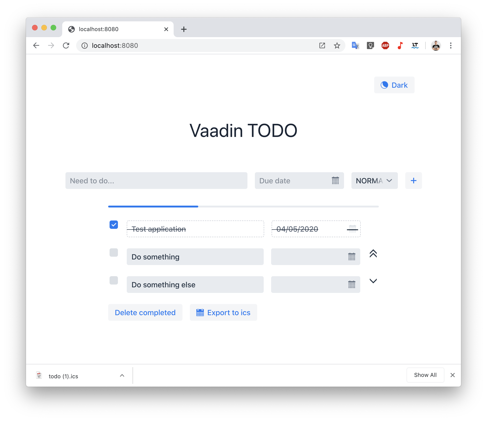

# Vaadin TODO



В проекте используются:
- Spring boot [Spring initializr](https://start.spring.io/)
- Spring Data + H2 [Link](https://spring.io/projects/spring-data)
- Vaadin 14 [Project starter](https://vaadin.com/start)
- Библиотека для работы c ics [ICAL4j](https://github.com/ical4j/ical4j)

### Сборка проекта

Прописать в `application.properties` необходимые настройки
```
./mvn package
```
Собранный **jar** файл будет находиться в `./target`

### Запуск
После сборки находясь в директории проекта
```
java -jar ./target/vaadin-todo-0.0.1-SNAPSHOT.jar
```

Запустить приложение 
```
http://localhost:8080
```
